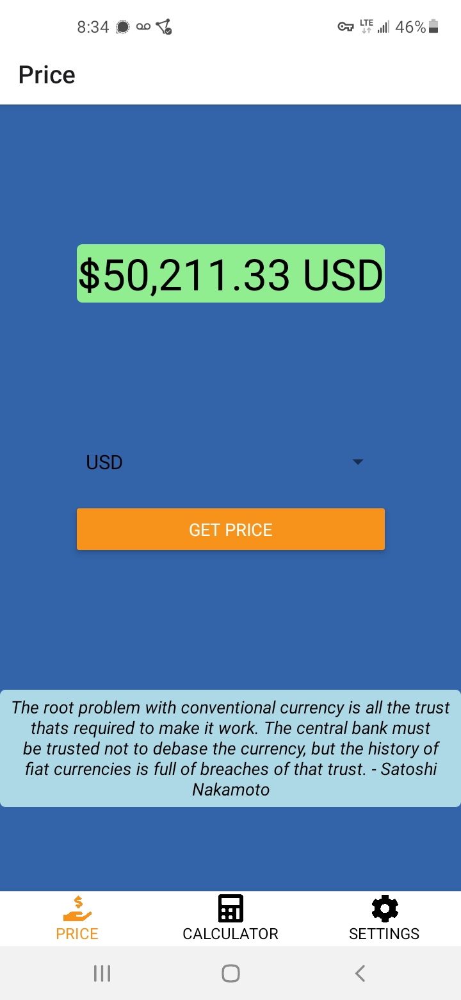

# BITCOIN PRICE WATCH

A bitcoin price app for Android and iOS written with React Native.

## Table of Contents

-   [General Info](#general-information)
-   [Technologies Used](#technologies-used)
-   [Features](#features)
-   [Screenshots](#screenshots)
-   [Usage](#usage)
-   [Project Status](#project-status)
-   [Deployment Status](#deployment-status)
-   [Room for Improvement](#room-for-improvement)
-   [Acknowledgements](#acknowledgements)
-   [Contact](#contact)

## General Information

With this app you can get live bitcoin prices in multiple fiat currencies, you can also use the calculator to see a bitcoin amount valued in fiat.

## Technologies Used

-   React Native
-   JavaScript
-   Expo

## Features

-   Live btc prices
-   BTC to fiat calculator
-   Insights from Satoshi

## Screenshots

## Usage

Simply select a currency and click a button to get live prices, enter a bitcoin amount in the calculator to get live conversion rates.

## Project Status

Project is: _in development_

Still some work can be done to improve but the app is functioning well.

## Deployment Status

Deployed as an APK and available for download directly on GitHub.

## Room for Improvement

-   Add settings
-   Improve styling

## Acknowledgements

-   Coded using Atom text editor
-   API data provided by blockchain.com
-   Thanks to the React community for creating some custom core components
-   Thanks to the nakamotoinstitute.org for collecting Satoshi's quotes
-   F-Droid banner image by <a href="https://unsplash.com/@bermixstudio?utm_source=unsplash&utm_medium=referral&utm_content=creditCopyText">Bermix Studio</a> on <a href="https://unsplash.com/s/photos/bitcoin?utm_source=unsplash&utm_medium=referral&utm_content=creditCopyText">Unsplash</a>

## Contact

If you would like to contact me please send me a message on Discord @secondl1ght#9164 or by e-mail at secondl1ght@protonmail.com, I would love to hear from you!

Personal portfolio website: <https://www.secondl1ght.site>
